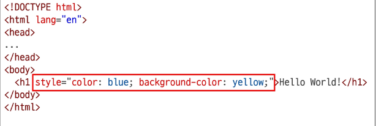
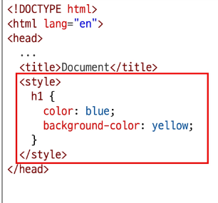
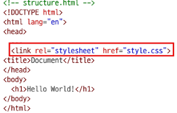

# CSS
- Cascading Style Sheet
- 웹 페이지의 디자인과 레이아웃을 구성하는 언어
## 적용 방법
- 인라인(Inline) 스타일
- 내부(Internal) 스타일
- 외부(External) 스타일

### 인라인(Inline)스타일
- HTML 요소 안에 style 속성 값으로 작성

### 내부(Internal) 스타일 시트
- head 태그 안에 style 태그에 작성

### 외부(External) 스타일 시트
- 별도 CSS 파일 생성 후 HTML link 태그를 사용해 불러오기

---
# CSS 기본 구조와 문법
- 선택자(Seletor)
    - '누구를' 꾸밀지 지정하는 부분
- 선언(Declaration)
    - '어떻게' 꾸밀지에 대한 구체적인 한 줄의 명령
    - 속성과 값이 한 쌍으로 이루어지며, 세미콜론(;)으로 끝남
- 속성(Property)
    - 바꾸고 싶은 스타일의 종류를 나타냄
- 값(Value)
    - 속성에 적용할 구체적인 설정을 나타냄
