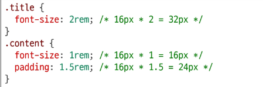
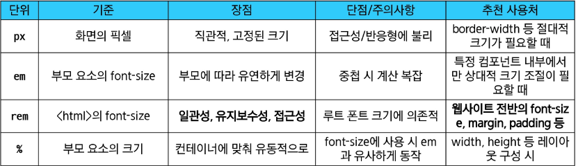

# CSS Declaration
- 선택된 요소에 적용할 스타일을 구체적으로 명시하는 부분
## 이론
### 속성(Property)
- 스타일링하고 싶은 기능이나 특성을 의미
- CSS가 미리 정의해 둔 키워드를 사용해야 함
- font-size, background-color, width, margin, padding 등

### 값(Value)
- 속성에 적용될 구체적인 설정
- 속성이 받을 수 있는 값의 종류는 정해져 있음
- 16px, lightgray, 100%, 10rem 등

### 값의 단위(Units)
- color: red;처럼 키워드로 끝나는 값도 있지만, 크기나 간격을 나타낼 때는 단위가 필수적
- 단위는 크게 절대 단위와 상대 단위로 나뉨

1. 절대 단위
    - px,pt,cm 등
    - 다른 요소의 영향을 받지 않는 고정된 크기
2. 상대 단위
    - %,em,rem,vw,vh 등
    - 다른 요소(부모,화면 표시 영역 등)의 크기에 따라 상대적으로 결정

### 절대 단위의 대표: "px"
- 화면을 구성하는 가장 작은 단위인 '픽셀'을 기준으로 하는 절대 단위
- 모니터 해상도에 따라 크기가 결정되며, 직관적이고 예측이 쉬움
- 장점:
    - 디자인 시안과 거의 동일한 결과물을 만들 수 있음
    - 요소의 크기를 명확하게 고정하고 싶을 때 유용
- 단점:
    - 사용자가 브라우저의 기본 폰트 크기를 변경해도 요소의 크기가 함께 조절되지 않아 접근성에 불리
    - 다양한 디바이스 크기에 유연하게 대응하는 반응형 디자인에 한계가 있음

### 상대 단위: "em"
- 부모(parent) 요소의 font-size를 기준으로 크기가 결정되는 상대 단위
- 만약 부모 요소에 font-size가 없다면, 그 상위 부모의 font-size를 상속 받음
- 장점
    - 부모 요소의 크기에 따라 자식 요소의 크기를 유연하게 조절할 수 있음
- 단점
    - 중첩 문제
    - em 단위를 사용하는 요소가 중첩도미ㅕㄴ 기준 크기가 계속 변경되어 계산이 복잡해지고 예측이 어려워짐
    - **rem**으로 해결

### 상대 단위의 해결사: "rem" (1/2)
- "Root em"
- em의 단점을 극복하기 위해 등장
- 부모 요소가 아닌, 최상위 요소(root element)인 < html >의 font-size를 기준으로 크기가 결정
- html의 기본 font-size는 대부분의 브라우저에서 **16px**

### 상대 단위의 해결사: "rem" (2/2)
- 일관성 및 예측 가능성
    - 요소가 아무리 깊게 중첩되어도 기준은 항상 html이므로, em처럼 계산이 복잡해지지 않음.
- 유지보수 용이성
    - html의 font-size만 변경하면 사이트 전체의 레이아웃과 폰트 크기를 일관되게 조절할 수 있음.
- 접근성 향상
    - 사용자가 브라우저에서 설정한 기본 폰트 크기를 html이 상속받으므로, 사용자의 설정에 맞춰 사이트 전체가 유연하게 확대/축소 됨.

## 단위 비교 정리
