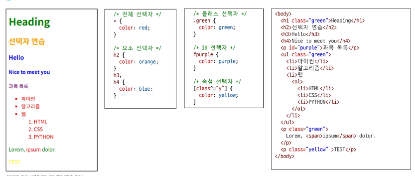

# CSS Selectors
- HTML 요소를 선택하여 스타일을 적용할 수 있도록 하는 선택자
## CSS Selectors 종류
- 기본 선택자
    - 전체(*) 선택자
    - 요소(tag) 선택자
    - 클래스(class) 선택자
    - 아이디(id) 선택자
    - 속성(attr) 선택자
- 결합자 (Combinators)
    - 자손 결합자 (" " (space))
    - 자식 결합자 (">")

### CSS Selectors: 기본 선택자 (1/3)

### CSS Selectors: 기본 선택자 (2/3)

### CSS Selectors: 기본 선택자 (3/3)

### CSS 결합자(Combinators) (1/2)

### CSS 결합자(Combinators) (2/2)
